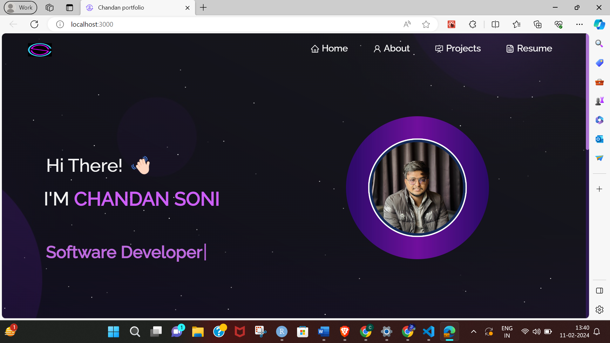

# Portfolio

Welcome to my portfolio!

## Description

I have created my portfolio using React.js

## Screenshots

  

  

  

## About

I am learning React through this portfolio website, Chandan.

This project was built using React.js, CSS3, and VSCode.

## Installation and Setup Instructions

Clone down this repository. You will need `node.js` and `git` installed globally on your machine.

1. Installation: `npm install`

2. In the project directory, you can run: `npm start`

## Project Link

Find the project live at: [PortFolio](https://chandanportfolio001.netlify.app/)
